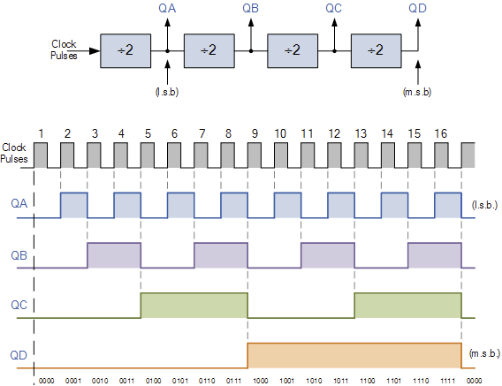

# Golang Quartz Clock demo

This project implements a "Quartz Clock" similar to a real digital watch / clock.

## Principle
A high frequency (a power of 2) input source signal is used to generate a 1 second output signal - serving as the "ticking" input for the clock.

Frequency dividers (also called flip-flops) are implemented as goroutine and share an input and output channel with the previous and next flip-flop (or are used as the source signal / output signal).

</br>

## Illustration

</br>

<a href="https://www.electronics-tutorials.ws/counter/count_1.html">
    
</a>

</br>

## Note
Obviously, this project has no use beside explanation / training.

An equivalent, more performant and accurate implementation is simply :

``` golang
time.Ticker(1 * time.Second)
```

